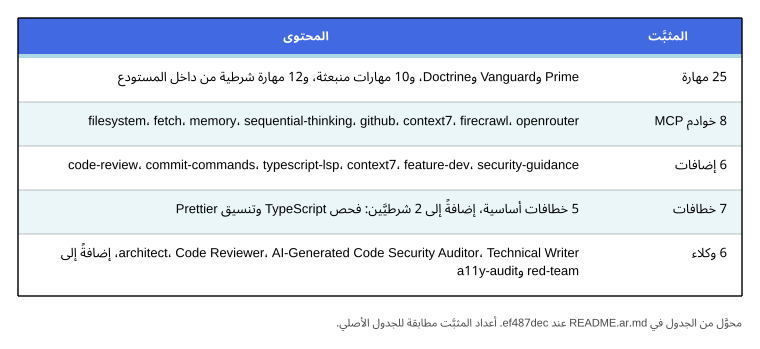

# Vantrilex Arsenal

**ثلاثة مهارات، سجلّ واحد، وطقم مثبَّت بإصدار محدَّد.**

Vantrilex Arsenal إضافة OpenCode قابلة للمشاركة، إلى جانب نظام مكوّنات. فهي
تجهّز مشروع الهدف بطقم منتقٍ ومثبَّت بإصدار محدَّد من المهارات وخوادم MCP
والإضافات والخطافات والوكلاء واتفاقيات التصميم — ثم تضبط طريقة استخدام ذلك
الطقم. وهي ليست حزمة تضم كل شيء، بل ترسانة تُجهَّز لكل مشروع على حدة.


المستودع يعمل على Node 25 بصيغة ESM وبصفر تبعيات. وهو **لا يحتوي على أي منطق
نماذج ذكاء اصطناعي أو تعلّم آلي** — فقط Markdown وJSON وNode ESM. ولا يجوز لأي
جزء هنا أن يخترع أمر تثبيت.


**الهوية البصرية.** العلامة والاسم المصوَّر وعائلة الأيقونات التسع هي هوية
الترسانة، وهي موصوفة في
[`brand/IDENTITY.md`](brand/IDENTITY.md) — اقرأه لتعرف المفهوم، وقائمة الأصول
كاملة، ولوحة الألوان، وقواعد الاستخدام. والنسخة أعلاه هي النسخة الساكنة
الخاصة بالأرضية الفاتحة؛ أما `brand/logo/arsenal-lockup-dark.svg` فهي النسخة
نفسها على أرضية داكنة مع عكس الأزرق الملكي إلى الأبيض، وهي النسخة الصحيحة
هناك. **والشعار لا يُحرَّك أبدًا** — فجميع الملفات الخمسة في `brand/logo/`
ساكنة، وكل حركة في هذه الهوية تقع في عائلة الأيقونات.


ولكل واحدة من التسع أخٌ متحرِّك بالهندسة نفسها تحت `brand/animated/`.

---

## ما هي الترسانة


جزءان، وحدّ فاصل بينهما:

- **إضافة OpenCode قابلة للمشاركة** — يوفّر `.opencode/` الإضافة، والمهارات
  الثلاث العليا، وأربعة وكلاء أدوار، وأربعة أوامر تشغيل.
- **نظام مكوّنات** — يمثّل `registry/` الفهرس الذي تسحب منه الإضافة،
  و`kit/kit.lock` هو الجزء المثبَّت والمتحقَّق منه من ذلك الفهرس الذي يستقبله
  كل مشروع.

الإضافة تجهّز ولا تقرّر. فالاختيار يقيم في السجلّ وفي `kit/kit.lock`، والسلوك
يقيم في Doctrine، ولا تطبّق الإضافة إلا ما يعلنه الاثنان. ولهذا فإن الطقم
**مثبَّت بإصدار محدَّد**: المشروع الذي جهّز نفسه في الربع الماضي يحصل على
المكوّنات نفسها التي حصل عليها في الربع الماضي.

---

## المهارات الثلاث

 **Vantrilex Prime** تجيب عن سؤال *أين تقع الترسانة؟*. تعمل مرة واحدة لكل
جهاز، لا مرة لكل مشروع: فهي توضّح ما هي الترسانة، وتعطي عنوان المستودع
الأساسي، وتشرح كيف تنسخه وتثبّت إصداره عبر `git rev-parse HEAD`، وتعدّد ما هو
موجود على القرص، وتبيّن كيف تؤكّد وجود المهارات الثلاث، وتثبّت ترتيب التشغيل
Prime ← Vanguard ← Doctrine، وتذكر القوانين الدائمة التي تطيعها كل مرحلة
لاحقة. وهي للتوجيه فقط: لا تستطلع المشروع، ولا تعرّف كيف يُنجَز العمل. انظر
[`.opencode/skills/vantrilex-prime/SKILL.md`](.opencode/skills/vantrilex-prime/SKILL.md).

 **Vantrilex Vanguard** تجيب عن سؤال *عمّا يحتاجه هذا المشروع؟*. وهي مرحلة
التجهيز (EQUIP)، وتعمل مرة واحدة لكل مشروع هدف. تكتشف واحدة من أربع حالات
للشروع عبر مسح المستودع بدل السؤال عنها، وجرد الموارد المتاحة، وتنتقِ الطقم
وتثبّته بأوامر حقيقية، وتتحقّق من أن كل مكوّن يُثبَّت ويُحمَّل، وتعرض ما جهّزته،
وتجهّز نظام التوثيق المكوّن من 28 ملفًا للمشروع الهدف. وهي ترفض تسليم طقم لم
تتحقّق منه. انظر
[`.opencode/skills/vantrilex-vanguard/SKILL.md`](.opencode/skills/vantrilex-vanguard/SKILL.md).

 **Vantrilex Doctrine** تجيب عن سؤال *كيف يُستخدم الطقم؟*. وهي مرحلة العمل.
تعرّف نموذج الأدوار، والقوانين الدستورية التي لا يجوز للوكيل خرقها، وخريطة
المراحل إلى المهارات، وسير العمل الخاص بالميزات والمراجعات والتدقيقات الأمنية
وإصلاح العلل والإصدارات — بما في ذلك حرّاس الإصدار من التمرّرة الثانية وقاطع
الدائرة بعد ثلاث محاولات (3-strike circuit breaker) الذي يوقف علةً صمدت أمام
ثلاث محاولات إصلاح فاشلة. انظر
[`.opencode/skills/vantrilex-doctrine/SKILL.md`](.opencode/skills/vantrilex-doctrine/SKILL.md).

الفصل بينهما مقصود: **توجيه، ثم انتقاء، ثم سلوك.** فلا تكرّر Prime حالات
المشروع الأربع عند Vanguard، ولا يكرّر Vanguard سير العمل عند Doctrine. وبذلك
يستطيع المشروع أن يشغّل المستكشف دون أن يرث القانون، وأن يُعاد تجهيزه بشروط
جديدة دون أن يُعاد التفاوض على قواعد سلوكه. وهذه المهارات الثلاث وحدها هي
المهارات العليا. أمّا **17 مجلد مهارة** أخرى تحت `.opencode/skills/` فتنقسم إلى
12 مكوّنًا شرطيًا يجهّزه Vanguard وإلى خمس آليات منقولة تُسلَّم على القرص دون
أن تُثبَّت في الطقم.

---

## لماذا يهمّ ذلك

المخططات الثلاثة والجدولان المقارنان أدناه هي الحجة كاملةً في صورة
مضغوطة: ما الذي تغيّره الترسانة في كلفة الإعداد والتحقّق وتكرار العمل.
اقرأها بقاعدة واحدة في ذهنك.

**كل رقم في هذا القسم تقديرٌ تقريبي إرشادي، وليس نتيجة قياس معياري.** فلم
يقس هذا المستودع نفسه يومًا. وحين تحمل أي خانة أو تسمية علامة `~` فهي
تخمينٌ ضمن رتبة المقدار التقريبية. وحين يخلو الرقم من `~` فهو عدد
متحقَّق منه تقرأه مباشرةً من `kit/kit.lock` أو `registry/` أو من سكربتات
البوابات. والمقياس الحقيقي الوحيد الوارد في هذا الملف هو مجموعة البوابات
نفسها: فالبوابات الست أدناه حقيقية وقابلة للتشغيل وخضراء — وأي فحص يتعذّر
تقييمه يُسجَّل فحصًا فاشلًا لا متخطًّى.


*الشكل 1 — الوقت التقريبي لتجهيز مشروع جديد واحد، موزَّعًا على مراحل التجهيز
الثلاث. فالتوجيه وانتقاء المكوّنات وإعداد البوابات يستغرق كل منها نحو ثلث
الوقت غير المجهَّز أو أقل. وكل رقم هنا تقديرٌ تقريبي إرشادي وليس نتيجة قياس
معياري؛ فلم يقس هذا المستودع نفسه يومًا.*


*الشكل 2 — النسبة التقريبية من التغييرات التي تجتاز بوابة قبل الدمج، مع
الترسانة وبلاها. وكلتا النسبتين تقديرٌ تقريبي إرشادي وليس نتيجة قياس معياري؛
فلم يقس هذا المستودع نفسه يومًا. أمّا البوابات الست نفسها فهي حقيقية وخضراء —
والمُقدَّر هنا هو فقط كم مرة يمرّ تغيير بوابة من إحداها.*


*الشكل 3 — نسب إعادة العمل وإعادة الاكتشاف التقريبية. الصف الأول هو نسبة
التغييرات التي أُعيد العمل عليها بعد أول تمريرة مراجعة، والصف الثاني هو نسبة
القرارات التي أُعيد اشتقاقها من الصفر في كل جلسة لعدم حمل أي شيء بينها. وكل
رقم هنا تقديرٌ تقريبي إرشادي وليس نتيجة قياس معياري؛ فلم يقس هذا المستودع
نفسه يومًا.*


*الجدول 1 — عشر قدرات، بلا ترسانة ومعها. في هذا الجدول الصفّان الحاملان لعلامة
`~` — الإعداد لأول مرة، والإعداد مجددًا — هما تقديران تقريبيان إرشاديان لا
نتائج قياس معياري؛ فلم يقس هذا المستودع نفسه يومًا. أمّا كل خانة غير موسومة
فهي عدد متحقَّق منه لا تقدير: 2,736 سجلًّا في الفهرس موزَّعةً على ستّة أنواع،
و12 أمر تثبيت متحقَّق منه والباقي موسوم بـ `unverified`، والمكوّنات الـ51
المثبَّتة نفسها من التزامٍ مثبَّت، وستة فحوص للسجلّ إضافةً إلى أحد عشر فحصًا
للطقم، وست بوابات يجب أن تنتهي كلٌّ منها بالرمز 0، وثلاث مهارات عليا وأربعة
وكلاء أدوار، ونظام التوثيق المُولَّد المكوّن من 28 ملفًا، و`mcp_cap` = 8.
وعمودا العناوين في هذه الصورة بالإنجليزية.*


*الجدول 2 — الجهد التقريبي في كل مرحلة، سبع مراحل من التوجيه إلى الإصدار. وكل
رقم زمني في العمودين الثاني والثالث هو تقديرٌ تقريبي إرشادي لتغيير واحد صغير،
لا نتيجة قياس معياري؛ فلم يُقَس أي وقت في هذا المستودع يومًا، فاقرأ هذه
الأرقام بوصفها حدسًا لا بوصفها بيانات. أمّا العمود الرابع فهو الجزء الذي ليس
تقديرًا — فهو يسمّي الآلية التي تتغيّر: تشغيل Prime مرة واحدة لكل جهاز، وتشغيل
Vanguard الذي يثبّت مكوّنات متحقَّقًا منها ويولّد التوثيق، وسير عمل Doctrine
وأدواره المسمّاة، وحرّاس التمرّرة الثانية قبل الاعتماد، ووكيل التدقيق
المخصّص، وقاطع الدائرة بعد ثلاث محاولات الذي يوقف إصلاحًا سيئًا، وبوابات
سجلّ التغييرات والتوثيق التي تحجب الإصدار.*

---

## البداية السريعة

```text
git clone https://github.com/3mar-baha/vantrilex-arsenal.git
cd vantrilex-arsenal
git rev-parse HEAD          # ثبّت هذا الالتزام؛ الطقم مثبَّت بإصدار محدَّد
```

ثم، بالترتيب الذي صُمّمت المهارات الثلاث لتعمل به:

1. **Prime** — شغّل `vantrilex-prime` مرة واحدة على هذا الجهاز. وهو يسجّل مكان
   الترسانة وما هو موجود على القرص.
2. **Vanguard** — شغّل `vantrilex-vanguard` في كل مشروع هدف تريد تجهيزه. فهو
   يكتشف حالة المشروع، ويثبّت الطقم، ويتحقّق منه، ويكتب توثيق المشروع الهدف.
3. **Doctrine** — شغّل `vantrilex-doctrine` للعمل نفسه: الميزات والمراجعات
   والتدقيقات والإصلاحات والإصدارات.

تغطي نقطتا الدخول في `.opencode/command/` مرحلتين من تلك المراحل ومهمتين
متمّمتين: `equip` تستدعي مرحلة استطلاع Vanguard، و`release` تقود مسار الإصدار،
و`doctor` تشغّل قياس الإعداد للقراءة فقط، و`prime` تُخرج كتلة `CONTEXT ANCHOR`
للجلسة. و`prime` ليست مدخلًا أماميًا لمهارة Vantrilex Prime، بل هي مُهيّئ
الجلسة.

---

## السجلّ


يضم مجلد `registry/` فهرس المكوّنات بصيغتين:

- **`registry/VANTRILEX_CATALOG.md`** — مصدر الحقيقة المقروء للإنسان. الجدول
  وملفات `_index.md` لكل نوع مُولَّدة؛ عدِّل المولِّد أو ملفات JSONL الجانبية،
  ولا تعدّل الجدول المُولَّد يدويًا أبدًا.
- **`registry/catalog.json`** — النسخة الآلية المُولَّدة التي يقرأها Vanguard.
  يُعاد توليدها ولا تُعدَّل يدويًا أبدًا.

يحمل الفهرس **2,736 سجلًّا** موزّعة على ستة أنواع:


وعناوين أعمدة هذه الصورة بالإنجليزية (`Kind` و`Records`)، ذلك أن الأرقام فيها
مطابقة تمامًا للجدول العربي، فاستُخدمت صورة واحدة للقراءةتين.

ويُثرى الفهرس من ستّة ملفات جانبية بصيغة JSONL — `registry/data/*.jsonl`،
ملف لكل نوع — لكل منها فرع يملكه واحد فقط في كل لحظة. ويحمل كل سجلّ مُشغِّل
`when_to_use`، و`phase` لدورة الحياة، و`tier`، و`verify_cmd`، و`install_cmd`،
وحالة `verification`، وعلم `default_selected`. و**22 مكوّنًا مُحدَّد بشكل
افتراضي**.

**قاعدة الأمانة.** يحمل 12 مكوّنًا أمر تثبيت مُتحقَّقًا منه. وأما بقية أوامر
التثبيت فمشتقّة آليًا من مستودع المصدر الخاص بالمكوّن، وموسومة بـ
`verification: unverified` بدل تقديمها كأنها مفحوصة. أمّا الوكلاء والإضافات
والخطافات فتُسجَّل بقيمة `null` في `install_cmd` مع `verification: unverified`
— بلا أي أمر مُختلق، أبدًا. فالأمر الذي يبدو معقولًا وهو خاطئ أسوأ من الاعتراف
بالجهل، لأن الوكيل سيشغّله.

---

## حصر الطقم

يثبّت `kit/kit.lock` **51 مكوّنًا مع قائمة `pending` فارغة**: 35 من `core` و
16 من `conditional`.


وبحسب التحقّق: **12 `verified`** و**39 `unverified`**. والمدخلات الـ12 المتحقَّقة
منها هي الـ10 مهارات المنبعثة من الخارج والمثبَّتة عبر `npx skills add`، إضافةً
إلى خادمي MCP وهما `context7` و`firecrawl` المثبَّتين بإصدار محدَّد.

ينقسم المثبَّت حسب النوع إلى مهارات وخوادم MCP وإضافات وخطافات ووكلاء:



وعناوين أعمدة صورة الحصر بالإنجليزية (`Kind` و`Locked` و`tier core` و
`tier conditional`)، ذلك أن الأرقام فيها مطابقة تمامًا للجدول العربي،
فاستُخدمت صورة واحدة للقراءةتين.

**حدّ 8 لخوادم MCP.** القيمة `mcp_cap` هي **8** — أي السقف الأقصى لخوادم MCP
من المستوى `core`، والمجموعة المثبَّتة تقع عليه بالضبط. وهذا الحدّ ضابطٌ
لميزانية السياق: فخوادم MCP أغلى المكوّنات من حيث البقاء مقيمة في السياق، ولذلك
يرفض الطقم تجاوز هذا السقف، وعند التعادل يفضّل مهارةً أو واجهة سطر أوامر على
خادم MCP.

يوجد على القرص **20 مجلد مهارة** تحت `.opencode/skills/`. و**15 منها مكوّنات
مثبَّتة في الطقم** — وهي **المهارات العليا الثلاث** (Prime وVanguard وDoctrine)
إضافةً إلى ال12 الشرطية. أمّا الخمسة الباقية — `circuit-breaker-guard` و
`github-release-packager` و`pre-mortem` و`preflight-system-doctor` و
`session-context-primer` — فهي آليات منقولة: موجودة على القرص، وغير مثبَّتة في
الطقم الافتراضي.

> **ملاحظة تنفيذية.** لا يملك OpenCode مجلد خطافات مستقلًّا — فالخطافات ردود
> نداء داخل الإضافة (callbacks). لذا تُنفَّذ الخطافات المنطقية الـ6 من المستوى
> Tier-0 داخل ملف إضافة واحد هو `.opencode/plugin/arsenal.ts`، لا في 6
> ملفات منفصلة. ويبقى الخطافان الشرطيان مثبَّتين لهذا السبب: فالإضافة تنفّذهما
> بالفعل، والتثبيت المنفصل سيكون مسارًا ثانيًا إلى الحارس نفسه.

---

## بوابات التحقّق


لا تنتهي المهمة لأن الشيفرة تعمل؛ بل تنتهي حين يُثبَت الشيء. وكل بوابة أدناه
قابلة للتشغيل من جذر المستودع، ويجب أن تنتهي جميعها بالرمز 0.


وإذا تعذّر تقييم فحص، فإن ذلك **فحص فاشل** لا فحص متخطّى. فاذكر ذلك في وصف
التغيير بدل ترك البوابة تبدو خضراء؛ و
[`docs/08-VERIFICATION.md`](docs/08-VERIFICATION.md) يحمل عقد البوابات
بأكمله.

---

## بنية المستودع

```text
vantrilex-arsenal/
├── .opencode/                    السطح المُسلَّم
│   ├── plugin/arsenal.ts         6 خطافات Tier-0 كردود نداء داخل الإضافة
│   ├── skills/                   20 مجلدًا: 3 مهارات عليا + 12 مكوّنًا شرطيًا
│   ├── agent/                    Leader / Guide / Implementer / red-team
│   └── command/                  نقاط دخول المشغّل: doctor، equip، prime، release
├── registry/                     مستوى البيانات — فهرس المكوّنات
│   ├── VANTRILEX_CATALOG.md      مصدر الحقيقة (جدول مُولَّد)
│   ├── catalog.json              النسخة الآلية المُولَّدة
│   ├── schema/catalog-v2.schema.json   عقد السجلّ
│   ├── data/                     ستّة ملفات JSONL جانبية + overlaps.yaml
│   ├── formatting/               مستندات أنظمة تصميم منتقاة + ATTRIBUTION.md
│   └── {skills,mcp,plugins,hooks,agents}/
│                                  سجلّات كل نوع وملفات _index.md المُولَّدة
├── scripts/                      Node ESM، بلا تبعيات
│   ├── generate-catalog-json.mjs مولِّد النسخة الآلية والجداول
│   ├── verify-registry.mjs       فحوص اتساق السجلّ
│   ├── verify-kit.mjs            فحوص ملف تثبيت الطقم
│   ├── verify-skills.mjs         فحوص صيغة ملف المهارة
│   └── *.sh                      تنسيق أشجار العمل وخطافات git والإصدار
├── kit/kit.lock                  الطقم المثبَّت من 51 مكوّنًا
└── docs/                         من 00-INDEX.md إلى 15-DECISIONS.md، إضافةً إلى
                                  docs/spec/ — مواصفتا الإدخال المعياريتان
```

يضم مجلد `docs/` مجموعة مرقّمة من 16 ملفًا من `00-INDEX.md` إلى
`15-DECISIONS.md`، إضافةً إلى `docs/spec/` الذي يضم مواصفتَي الإدخال
المعياريتين: `VANTRILEX_KIT_SPEC.md` و`VANTRILEX_SKILLS_SPEC.md`. أما نظام
التوثيق المكوّن من 28 ملفًا الذي يجهّزه Vanguard فيُولَّد في *المشروع الهدف* وقت
التشغيل، وهو مقصود أنه ليس جزءًا من بنية هذا المستودع.

---

## أدوات التشغيل

`git` و**Node 25** هما المتطلّبان الصلبان الوحيدان. فأدوات السجلّ — مولِّد
الفهرس، ومحقّق السجلّ، ومحقّق الطقم، ومحقّق المهارات — مكتوبة بـ Node ESM
بلا تبعيات. لا Python، ولا وقت تشغيل لغة ثانية، ولا حزمة تجميع، ولا إطار عمل،
ولا `jq`، ولا مُبدّل طرفي (terminal multiplexer). وهذا مقصود: فإضافة قابلة
للمشاركة لا ينبغي أن تطلب من المستخدم تثبيت وقت تشغيل لغة لمجرد قراءة فهرس.
وسكربتات الصدفة بصيغة `bash` المتوافقة مع POSIX، ويفحصها `shellcheck`.

---

## الترخيص

MIT © 2026 3mar-baha. انظر [LICENSE](LICENSE).

تحتفظ مستندات أنظمة التصميم المنبعثة من أطراف ثالثة تحت
`registry/formatting/` بتراخيص MIT الأصلية لها، ومنحها الاعتراف في
[`registry/formatting/ATTRIBUTION.md`](registry/formatting/ATTRIBUTION.md).
