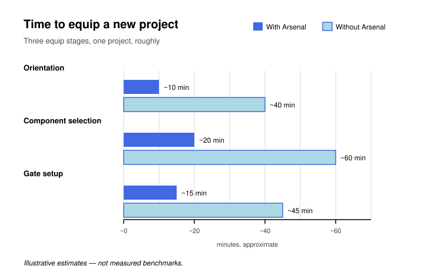
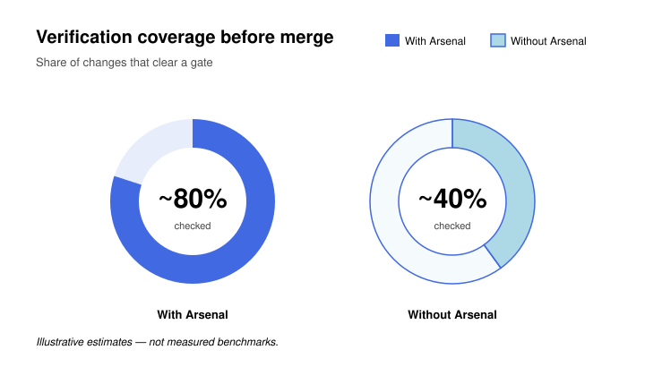
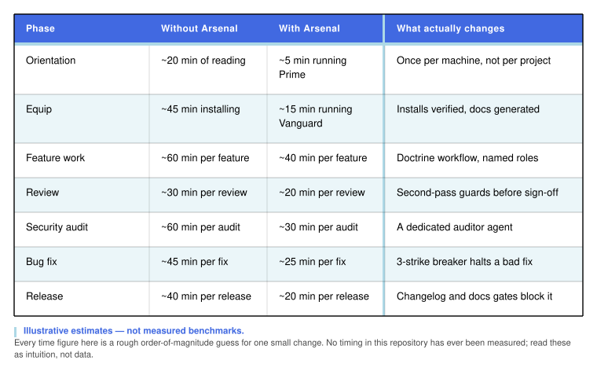
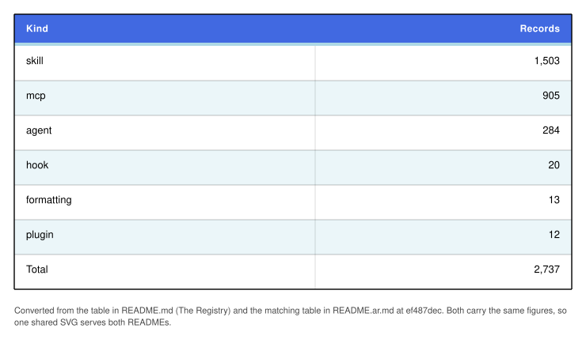
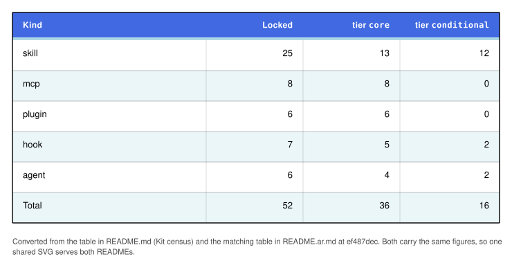
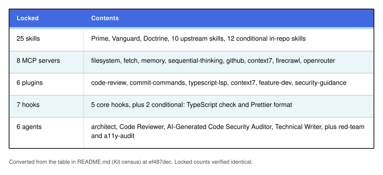

# Vantrilex Arsenal

**Three skills, one registry, one pinned kit.**

Vantrilex Arsenal is a shareable OpenCode plugin plus a component system. It
provisions a target project with a curated, version-pinned kit of skills, MCP
servers, plugins, hooks, agents, and design conventions — then governs how that
kit is used. It is not a bundle of everything; it is an arsenal you equip per
project.


The repository is Node 25, ESM, and zero dependencies. It contains **no AI or
ML model logic** — only Markdown, JSON, and Node ESM. Nothing here may invent an
install command.


**Visual identity.** The mark, the stencil wordmark, and the nine-icon
family are the Arsenal's identity, specified in
[`brand/IDENTITY.md`](brand/IDENTITY.md) — read it for the concept, the
complete asset list, the palette, and the usage rules. The lockup above is the
static light-ground variant; `brand/logo/arsenal-lockup-dark.svg` is the same
lockup on a dark ground with royal blue inverted to white, and is the correct
file there. **The logo is never animated** — all five files in `brand/logo/`
are static, and every motion in the identity lives in the icon family.


Each of the nine has an animated sibling with the same geometry under
`brand/animated/`.

---

## What the Arsenal is


Two parts, with one boundary between them:

- **A shareable OpenCode plugin** — `.opencode/` ships the plugin, the three
  top-level skills, four role agents, and four operator commands.
- **A component system** — `registry/` is the catalog the plugin draws from,
  and `kit/kit.lock` is the pinned, verified subset of that catalog every
  project receives.

The plugin provisions; it does not decide. Selection lives in the Registry and
`kit/kit.lock`, conduct lives in Doctrine, and the plugin only enforces what
those two declare. That is why the kit is *version-pinned*: a project that
equipped last quarter gets the same components it got last quarter.

---

## The three skills

 **Vantrilex Prime** answers *where the Arsenal is*. It runs once per machine,
not once per project: it states what the Arsenal is, gives the canonical
repository URL, shows how to clone and pin it with `git rev-parse HEAD`, lists
what is on disk, shows how to confirm the three skills exist, fixes the order
Prime → Vanguard → Doctrine runs in, and states the standing laws every later
phase obeys. Orientation only — it does not survey the project, and it does not
define how work is conducted. See
[`.opencode/skills/vantrilex-prime/SKILL.md`](.opencode/skills/vantrilex-prime/SKILL.md).

 **Vantrilex Vanguard** answers *what does this project need?* It is the EQUIP
phase, run once per target project. It detects one of four project states by
scanning the repository rather than asking, surveys the resources present,
selects and installs the kit with real commands, verifies each component
installs and loads, reports what it equipped, and prepares the 28-file
target-project documentation system. It refuses to hand over a kit it has not
verified. See
[`.opencode/skills/vantrilex-vanguard/SKILL.md`](.opencode/skills/vantrilex-vanguard/SKILL.md).

 **Vantrilex Doctrine** answers *how is the kit used?* It is the WORK phase. It
defines the role model, the constitutional laws an agent may not break, the
phase-to-skill map, and the workflows for features, reviews, security audits,
bug fixes, and releases — including the second-pass release guards and the
3-strike circuit breaker that halts a defect that has survived three failed
fix attempts. See
[`.opencode/skills/vantrilex-doctrine/SKILL.md`](.opencode/skills/vantrilex-doctrine/SKILL.md).

The separation is deliberate: **orientation, then selection, then conduct.**
Prime does not duplicate Vanguard's four project states, and Vanguard does not
duplicate Doctrine's workflows. A project can therefore run the scout without
inheriting the law, and can be re-equipped on new terms without renegotiating
its conduct rules. Only those three are top-level skills. The other **17 skill
folders** under `.opencode/skills/` split into the 12 conditional components
Vanguard equips and five transplanted mechanisms that ship on disk without being
locked into the kit.

---

## Why it matters

The three charts and the two comparison tables below are the whole argument
compressed: what the Arsenal changes about the cost of setting up, verifying,
and repeating work. Read them with one rule in mind.

**Every figure in this section is a rough illustrative estimate, not a measured
benchmark.** This repository has never benchmarked itself. Where a cell or a
label carries a `~`, it is a guess at rough order of magnitude. Where a figure
carries no `~`, it is a verified count you can read straight out of
`kit/kit.lock`, `registry/`, or the gate scripts. The only measured claim in
this README is the gate suite itself: the six gates below are real, runnable,
and green — a check that cannot be evaluated is recorded as a failed check, not
a skipped one.



*Figure 1 — Rough time to equip one new project, split across the three equip
stages. Orientation, component selection, and gate setup each take about a third
of the unassisted time or less. Every figure is a rough illustrative estimate,
not a measured benchmark; this repository has never benchmarked itself.*



*Figure 2 — Rough share of changes that clear a gate before merge, with and
without the Arsenal. Both percentages are rough illustrative estimates, not
measured benchmarks; this repository has never benchmarked itself. The six gates
themselves are real and green — what is estimated here is only how often a
change passes through one of them.*


*Figure 3 — Rough rework and rediscovery rates. The first row is the share of
changes reworked after the first review pass; the second is the share of
decisions re-derived from scratch each session because nothing carried over.
Every figure is a rough illustrative estimate, not a measured benchmark; this
repository has never benchmarked itself.*


*Table 1 — Ten capabilities, unassisted against equipped. In this table the
two rows carrying `~` — first-time setup and setup again — are rough
illustrative estimates, not measured benchmarks; this repository has never
benchmarked itself. Every unmarked cell is a verified
count, not an estimate: 2,737 catalog records over six kinds, 12 verified
install commands with the rest marked `unverified`, the same 52 pinned
components from a pinned commit, six registry checks plus eleven kit checks,
six gates each required to exit 0, three top-level skills and four role
agents, the generated 28-file doc system, and `mcp_cap` = 8.*



*Table 2 — Rough effort per phase, seven phases from orientation to release.
Every time figure in the second and third columns is a rough illustrative
estimate for one small change, not a measured benchmark; no timing in this
repository has ever been measured, so read these as intuition rather than data.
The fourth column is the part that is not an estimate — it names the mechanism
that changes: Prime running once per machine, Vanguard installing verified
components and generating the docs, the Doctrine workflows and named roles,
the second-pass guards before sign-off, the dedicated auditor agent, the
3-strike breaker that halts a bad fix, and the changelog and docs gates that
block a release.*

---

## Quickstart

```text
git clone https://github.com/3mar-baha/vantrilex-arsenal.git
cd vantrilex-arsenal
git rev-parse HEAD          # pin this commit; the kit is version-pinned
```

Then, in the order the three skills are meant to run:

1. **Prime** — run `vantrilex-prime` once on this machine. It records where the
   Arsenal lives and what is on disk.
2. **Vanguard** — run `vantrilex-vanguard` in each target project you want to
   equip. It detects the project state, installs the kit, verifies it, and
   writes the target-project documentation.
3. **Doctrine** — run `vantrilex-doctrine` for the work itself: features,
   reviews, audits, fixes, releases.

Operator entry points in `.opencode/command/` cover two of those phases and two
adjacent jobs: `equip` invokes the Vanguard scout pass, `release` drives the
release lane, `doctor` runs the read-only preflight measurement, and `prime`
emits the session `CONTEXT ANCHOR` block. `prime` is not a front door to the
Vantrilex Prime skill — it is the session primer.

---

## The Registry


`registry/` holds the component catalog in two forms:

- **`registry/VANTRILEX_CATALOG.md`** — the human-readable source of truth. The
  table and the per-kind `_index.md` files are generated; edit the generator or
  the JSONL sidecars, never the generated table by hand.
- **`registry/catalog.json`** — the generated machine mirror Vanguard reads. It
  is regenerated, never hand-edited.

The catalog carries **2,737 records** across six kinds:



The catalog is enriched from six `registry/data/*.jsonl` sidecars — one per
kind — each with exactly one owning branch at a time. Every record carries a
`when_to_use` trigger, a lifecycle `phase`, a `tier`, a `verify_cmd`, an
`install_cmd`, a `verification` state, and a `default_selected` flag. **22
components are default-selected.**

**The honesty rule.** 12 components carry a verified install command. Every
remaining install command is mechanically derived from the component's source
repository and is marked `verification: unverified` rather than presented as
checked. Agents, plugins, and hooks are recorded with a `null` `install_cmd`
and `verification: unverified` — no invented command, ever. A plausible-looking
wrong command is worse than an admission of ignorance, because an agent will
run it.

---

## Kit census

`kit/kit.lock` pins **52 components with an empty `pending` list**: 36 tier
`core` and 16 tier `conditional`.



By verification: **12 `verified`** and **40 `unverified`**. The 12 verified
entries are the 10 upstream skills installed by `npx skills add`, plus the
`context7` and `firecrawl` MCP servers, which are version-pinned.

The lock breaks down by kind into skills, MCP servers, plugins, hooks, and
agents:



**The 8-MCP cap.** `mcp_cap` is **8** — the ceiling on tier `core` MCP servers,
and the locked set sits exactly at it. The cap is a context-budget backstop: MCP
servers are the most expensive components to keep resident, so the kit refuses
to grow past that ceiling and, on ties, prefers a skill or a CLI over an MCP
server.

**20 skill folders** exist on disk under `.opencode/skills/`. **15 of them are
locked kit components** — the **three top-level skills** (Prime, Vanguard,
Doctrine) plus the 12 conditional ones. The remaining five —
`circuit-breaker-guard`, `github-release-packager`, `pre-mortem`,
`preflight-system-doctor`, and `session-context-primer` — are transplanted
mechanisms: present on disk, not locked into the default kit.

> **Implementation note.** OpenCode has no standalone hooks directory — hooks
> are plugin callbacks. The 7 logical Tier-0 hooks are implemented inside a
> single plugin file, `.opencode/plugin/arsenal.ts`, rather than as 7 separate
> files. The two conditional hooks stay locked for that reason: the plugin
> already implements them, and a separate install would be a second path to the
> same guard. The seventh, `task-dispatcher`, classifies every user message
> into one of five Vanguard task scenarios; see
> [`docs/16-TASK-DISPATCH.md`](docs/16-TASK-DISPATCH.md).
>
> **OpenCode V2 status.** `task-dispatcher` now runs on the V2 surface — the
> contract the plugin mirrors from `@opencode/plugin` 2.0.22. It is registered
> from the plugin's `setup()` against the session `prompt` hook and appends its
> five-line instruction to `event.prompt.text`. The other six hooks and the
> docs-discipline guard are still registered from the V1 `server()` surface and
> are **inert under V2** — they never fire, and that gap is deliberate and
> unfinished, not a completed port. The module default-exports both surfaces in
> one object, because V2 reads `id` plus `setup()` and ignores `server()`, while
> V1 (`>= 1.18.29`) reads `server()` and ignores `setup()`. Details in
> [`docs/16-TASK-DISPATCH.md`](docs/16-TASK-DISPATCH.md).

---

## Verification gates


A task is not finished because the code runs; it is finished when the thing is
proven. Every gate below is runnable from the repository root and every one must
exit 0.


If a check cannot be evaluated, that is a **failed** check, not a skipped one.
Say so in the change description rather than leaving the gate green-looking;
[`docs/08-VERIFICATION.md`](docs/08-VERIFICATION.md) carries the full gate
contract.

---

## Repository layout

```text
vantrilex-arsenal/
├── .opencode/                    Shipped surface
│   ├── plugin/arsenal.ts         The 7 Tier-0 hooks as plugin callbacks
│   ├── skills/                   20 folders: 3 top-level skills + 12 conditional kit components
│   ├── agent/                    Leader / Guide / Implementer / red-team
│   └── command/                  Operator entry points: doctor, equip, prime, release
├── registry/                     Data plane — the component catalog
│   ├── VANTRILEX_CATALOG.md      Source of truth (generated table)
│   ├── catalog.json              Generated machine mirror
│   ├── schema/catalog-v2.schema.json   The record contract
│   ├── data/                     Six per-kind JSONL sidecars + overlaps.yaml
│   ├── formatting/               Curated design-system documents + ATTRIBUTION.md
│   └── {skills,mcp,plugins,hooks,agents}/
│                                  Per-kind records and generated _index.md
├── scripts/                      Node ESM, zero dependencies
│   ├── generate-catalog-json.mjs Generator for the mirror and the tables
│   ├── verify-registry.mjs       Registry consistency checks
│   ├── verify-kit.mjs            Kit lockfile checks
│   ├── verify-skills.mjs         Skill-file format checks
│   └── *.sh                      Worktree orchestration, git hooks, release
├── kit/kit.lock                  The pinned 52-component kit
└── docs/                         00-INDEX.md … 16-TASK-DISPATCH.md, plus
                                  docs/spec/ — the two canonical input specs
```

`docs/` holds a 17-file numbered set from `00-INDEX.md` through
`16-TASK-DISPATCH.md`, plus `docs/spec/` which holds the two canonical input
specifications, `VANTRILEX_KIT_SPEC.md` and `VANTRILEX_SKILLS_SPEC.md`. The
28-file documentation system Vanguard prepares is generated into the *target*
project at runtime and is deliberately not part of this repository's layout.

---

## Toolchain

`git` and **Node 25** are the only hard requirements. The Registry tooling — the
catalog generator, the registry verifier, the kit verifier, the skills verifier
— is dependency-free Node ESM. No Python, no second language runtime, no
bundler, no framework, no `jq`, and no terminal multiplexer. This is deliberate:
a shareable plugin should not ask a user to install a language runtime just to
read a catalog. Shell scripts are POSIX `bash`, checked by `shellcheck`.

---

## License

MIT © 2026 3mar-baha. See [LICENSE](LICENSE).

Vendored third-party design-system documents under `registry/formatting/`
retain their original MIT licences and are credited in
[`registry/formatting/ATTRIBUTION.md`](registry/formatting/ATTRIBUTION.md).
